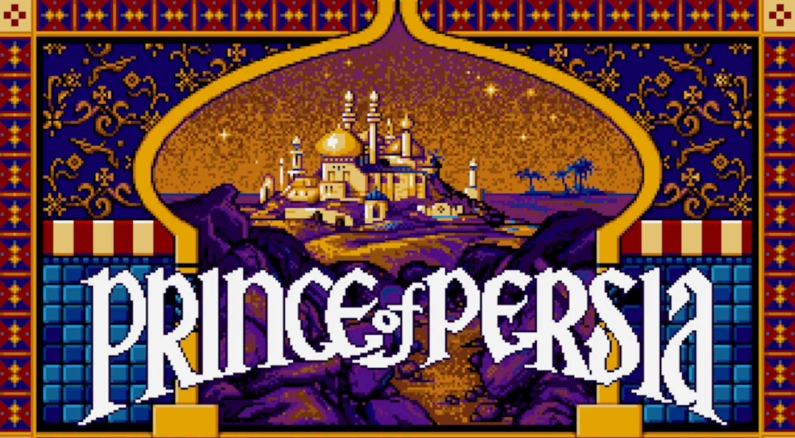
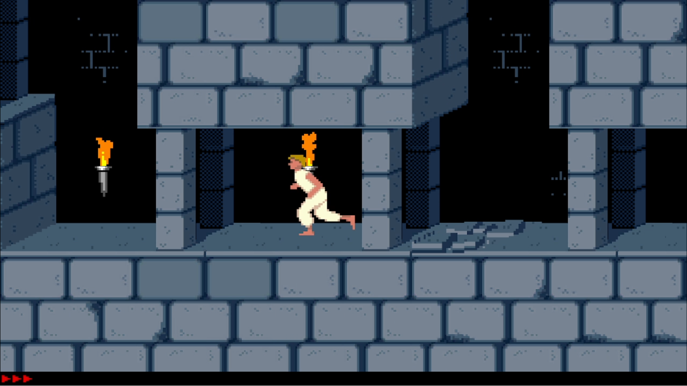
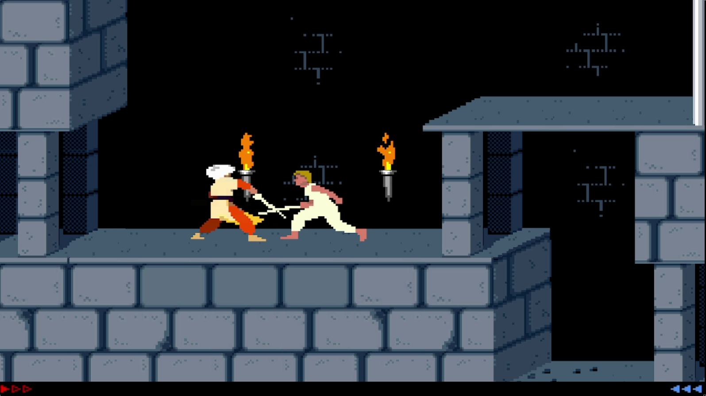



# Prince of Unity

Developed with Unity, this game is a hobbyist black box demo remake of Jordan Mechner's 
classic *Prince of Persia* (1989).

## Why to remake Prince of Persia?

The best way to learn something is doing something. I wanted to learn how to use Unity 
engine to develop games and Prince of Persia is one of the best games ever. Besides that, 
that game is one of the latest classics of all times developed by a solo developer (well, 
I know that is not exactly true for the PC version but at is origins in Apple II it really 
is), so rebuild it just by myself was a realistic goal. Mechner published original source 
code some years ago and it has been remade in other development languages by other hobbyist
developers, so I don't expect any legal issues for recreating this game just for 
learning purposes as far I keep it free and open source.

## Why to use Unity?

I made a [first attempt with Unreal](https://github.com/dante-signal31/PrinceOfUnreal). That engine 
is great but I felt they put the focus in 3D gaming while 2D developments was like a second class 
citizen. Its Blueprints system is brilliant, but I missed coding but the C++ alternative was not 
an alternative as I hate that language. Besides all those things, I made all possible mistakes a 
developer can do with a codebase: no functional test, no cohesion, too much coupling, too much 
repeated code. You have to pay every sin and after nearly a year working in that project it was 
an spaghetti nightmare where I was spending more time finding and fixing regression errors than 
actually implementing the new functionality that caused those regression errors.

Finally, I decided to thrash that implementation and start it again from scratch using Unity.

Unity is far from being perfect, but I've found a better 2D support, an easier coding language (C#) 
I'm comfortable with and a a far more evident testing framework. With the lessons I had learned from 
my previous failure, after another year working in this attempt I feel happy with this new codebase.
Everything in this life can be improved, but I feel honestly proud of this codebase. I've got very 
specialized components that are widely reused across the project (DRY), I know where is old code and 
where to put new code and I've developed a big collection of functional tests (130+) that make easy 
to detect and fix regression errors. I think an Unity new comer can learn many things studying my 
resulting codebase.

I've really enjoyed my experience developing in Unity in contrast with my experience with Unreal.

## What you'll find in Prince of Unity?

I've implemented only the first three levels of the original game, and a freely inspired
version of the level where Prince fights against the visier. Those levels are enough to 
implement the usual core mechanics of a game: movements, pickables, fighting, enemy AI, 
level transitions, etc. Those levels works pretty much as in the original game.

I've even implemented some of the original cheat keys, they are fun and made my debugging easier ;-).

The game is functional. I've ended Alpha testing phase and I'm about to enter Beta phase (mainly 
family&friends). That means you can play with this game comfortably but you may still find some 
bugs. Please, fill me an issue through this page with any bug you may find so I can fix it in 
further versions.

## Installation

See current [installation instructions](https://github.com/dante-signal31/Prince_of_Unity/wiki/1---Installation) at this homepage wiki.

If you like the developer way, just clone this repository and run the game from inside Unity, but 
in this case refer to [developer section](https://github.com/dante-signal31/Prince_of_Unity#developers) at this 
page to find out how to run properly the game inside editor.

## Usage

See current [usage instructions](https://github.com/dante-signal31/Prince_of_Unity/wiki/2---Usage) at this homepage wiki.

Nowadays, the game has support for keyboard and gamepad input.

## Developers

If you clone this project and want to run the game from Unity make sure to run it
from *Disclaimer* scene. Data persistence across scene is got using a game manager that 
is kept from the very first scene (actually Disclaimer one). That game manager must be unique
so every other level does not have it as it is expected it will be taken from previous scenes.

Testing scenes have their own game managers so they can be run on their own.

Feel free to propose any pull request. Just make sure that existing tests pass correctly and 
that any new functionality comes with new tests to cover it.

All the codebase is covered with an open source BSD-3 license, so you have plenty of room to 
play with that codebase. 

## Feedback

Author: Dante Signal31 e-mail: dante.signal31@gmail.com

## SUPPORTERS

